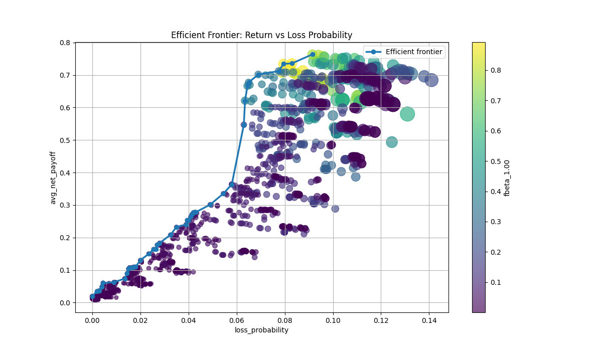
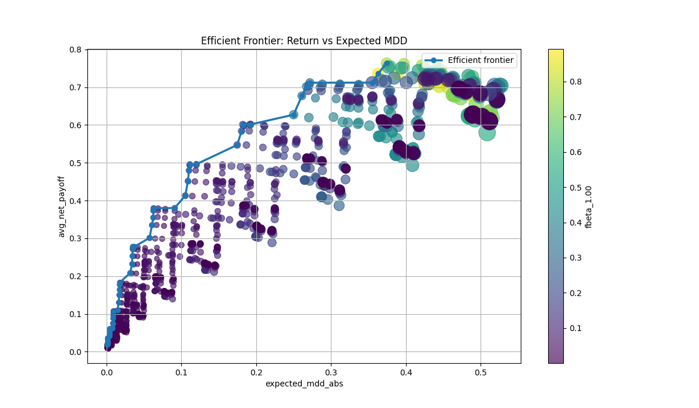
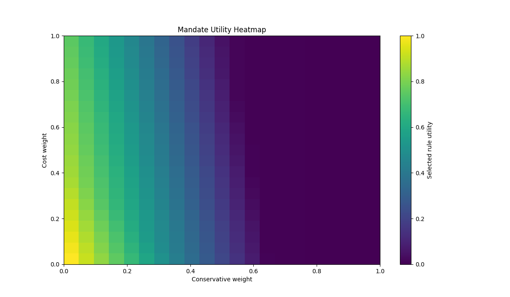

# Mandate-Conditioned Trading Rule Calibration

This repository implements a Monte Carlo framework for estimating mandate-specific optimal trading rules under an Ornstein-Uhlenbeck process and Triple Barrier Method.

The main idea is that a trading rule should not be selected only by generic machine learning metrics such as accuracy, precision, recall, or F1-score. In financial decision-making, the optimal rule depends on the mandate of the investment team.

For example, a conservative portfolio manager may prefer fewer false positive trades, lower drawdown, and lower signal frequency. On the other hand, an aggressive portfolio manager may prefer higher opportunity capture, even if the strategy produces more frequent signals or accepts larger interim losses.

Therefore, this framework treats precision, recall, and F-beta not as final objective functions, but as diagnostic metrics implied by a cost-adjusted payoff optimization problem.

---

## Core Question

The central question of this project is:

> Given a specific investment mandate, such as 70% conservative and 30% aggressive, which trading rule should be selected?

Instead of directly maximizing F1-score or F-beta score, this framework defines a mandate-conditioned utility function:

```text
Utility(rule)
= aggressive_weight × ReturnScore(rule)
- conservative_weight × RiskScore(rule)
- cost_weight × CostScore(rule)
```

Then the optimal trading rule is selected as:

$$\text{rule}^* = \arg \max \text{Utility(rule)}$$

After selecting the optimal rule, the framework reports the implied precision, recall, and F-beta profile of that rule.

### Motivation

In classification-based trading strategies, precision and recall have different economic meanings.

```angular2html
Precision:
    When the model generates a trading signal,
    how often is the signal profitable?

Recall:
    Among all profitable trading opportunities,
    how many does the model capture?
```

From an investment perspective:

```angular2html
High precision:
    Fewer false positive trades
    Lower realized losses from wrong entries
    More suitable for conservative strategies

High recall:
    Fewer missed opportunities
    Higher upside capture
    More suitable for aggressive strategies
```

However, precision and recall alone are not enough. A financial trading rule must also consider:

```angular2html
- transaction costs
- signal frequency
- drawdown
- loss probability
- false positive losses
- missed opportunity costs
- holding period
- turnover
```

This project therefore frames trading rule selection as a cost-adjusted payoff optimization problem.

### Framework Overview

The simulation pipeline is as follows:

1. Simulate price or spread paths using an Ornstein-Uhlenbeck process

2. Generate candidate trading rules using:
   - entry z-score threshold
   - profit-taking barrier
   - stop-loss barrier
   - vertical barrier

3. Apply the Triple Barrier Method to each trading opportunity

4. Evaluate each trading rule by:
   - expected net payoff
   - loss probability
   - expected maximum drawdown
   - signal frequency
   - precision
   - recall
   - F-beta score

5. Construct mandate-specific efficient frontiers

6. Select the optimal trading rule under a given mandate

7. Interpret the implied precision-recall-F-beta profile

### Model Assumption

The underlying price or spread process is assumed to follow an Ornstein-Uhlenbeck process:

$$dX_t = \theta(\mu - X_t)dt + \sigma dW_t$$

where:

- $X_t$     : price, spread, or deviation process
- $\mu$      : long-run mean
- $\theta$   : speed of mean reversion
- $\sigma$   : volatility
- $W_t$     : Brownian motion

The exact discretization is used for simulation.

### Trading Rule

The strategy is based on mean reversion.

The z-score is defined as:

$$z_t = \frac{X_t - \mu}{\sigma_{LR}}$$

where the long-run standard deviation of the OU process is:

$$\sigma_{LR} = \frac{\sigma}{\sqrt{2\theta}}$$

The entry rule is:

```
If z_t <= -entry_z:
    enter long position

If z_t >= entry_z:
    enter short position

Otherwise:
    no position
```

Each trade is evaluated using the Triple Barrier Method.

### Triple Barrier Method

For each entry signal, the trade is evaluated using three barriers:

```angular2html
1. Profit-taking barrier
2. Stop-loss barrier
3. Vertical time barrier
```

- A trade receives label +1 if the profit-taking barrier is hit first.

- A trade receives label -1 if the stop-loss barrier is hit first.

- A trade receives label 0 if the vertical barrier is reached before either horizontal barrier.

The realized payoff is computed as:

**net_payoff = gross_payoff - transaction_cost - signal_cost**

### Payoff-Based Objective

Unlike standard classification problems, this framework does not directly maximize F1-score.  Instead, the goal is to maximize mandate-conditioned utility.

For each trading rule:

```angular2html
ReturnScore = scaled expected net payoff

RiskScore = scaled risk measure
            such as loss probability or expected drawdown

CostScore = scaled signal frequency
            or turnover-related cost
```

The mandate utility is defined as:

```angular2html
Utility(rule)
= aggressive_weight × ReturnScore
- conservative_weight × RiskScore
- cost_weight × CostScore
```

For example, a 70% conservative and 30% aggressive mandate can be written as:

```angular2html
conservative_weight = 0.7
aggressive_weight   = 0.3
```

The selected rule is the one with the highest mandate utility.

### Efficient Frontier

The project visualizes the trade-off between payoff and risk using an efficient frontier.





```
==============================
Selected Rule: 70% Conservative / 30% Aggressive
==============================
rule_id             1571.000000
entry_z                3.000000
profit_take_z          1.500000
stop_loss_z            0.750000
vertical_barrier      40.000000
avg_net_payoff         0.019616
loss_probability       0.000000
expected_mdd_abs       0.001175
signal_frequency       0.000206
precision              0.368932
recall                 0.001046
fbeta_0.50             0.005171
fbeta_1.00             0.002086
fbeta_2.00             0.001306
mandate_utility        0.004785
Name: 1571, dtype: float64
```

A trading rule is considered efficient if no other rule has both:

- higher or equal expected net payoff
- lower or equal risk

with at least one strict improvement. The efficient frontier can be visualized as:

```
x-axis : risk metric
         loss probability or expected drawdown
y-axis : expected net payoff
color  : implied F-beta score
size   : signal frequency
```

This allows the user to compare not only which strategy has the highest payoff, but also which strategies are efficient under different risk and cost preferences.

### F-beta as Diagnostic Metric

F-beta is not used as the primary objective. Instead, F-beta is used to interpret the selected trading rule.  The F-beta score is defined as:

$$F_\beta = (1 + \beta^2) \frac{\text{Precision} \cdot \text{Recall}}  {\beta^2 \cdot \text{Precision} + \text{Recall}}$$

where:

- beta < 1: precision-oriented profile
- beta = 1: balanced precision-recall profile
- beta > 1: recall-oriented profile

After the mandate-optimal rule is selected, the framework reports its implied:

- precision
- recall
- F0.5 score
- F1 score
- F2 score

This makes it possible to interpret whether a conservative mandate naturally selects a precision-oriented trading rule, and whether an aggressive mandate naturally selects a recall-oriented trading rule.

### Key Insight

The key insight is:

The optimal F-beta profile should be inferred from the payoff-maximizing trading rule, not imposed as the objective function.

In other words:

```angular2html
Wrong direction:
    mandate → optimal F-beta → trading rule

Better direction:
    mandate → cost-adjusted payoff utility → optimal trading rule → implied F-beta
```

This distinction is important because financial trading decisions are path-dependent and cost-sensitive. A rule with a high F1-score may still perform poorly after transaction costs, signal frequency costs, and drawdown penalties are considered.

### Example Mandates

#### Conservative Mandate

```angular2html
conservative_weight = 0.8
aggressive_weight   = 0.2
cost_weight         = high
```

Expected behavior:
```angular2html
- higher entry threshold
- fewer signals
- higher precision
- lower recall
- lower drawdown
- lower signal frequency
```

#### Balanced Mandate

```angular2html
conservative_weight = 0.5
aggressive_weight   = 0.5
cost_weight         = medium
```

Expected behavior:

```angular2html
- moderate entry threshold
- balanced precision and recall
- moderate signal frequency
- moderate payoff-risk trade-off
```

#### Aggressive Mandate
```angular2html
conservative_weight = 0.2
aggressive_weight   = 0.8
cost_weight         = low
```

Expected behavior:

```angular2html
- lower entry threshold
- more signals
- higher recall
- lower precision
- higher opportunity capture
- higher risk tolerance
```

### Outputs

The framework produces the following outputs:

```angular2html
1. Strategy evaluation table

2. Efficient frontier:
   expected net payoff vs loss probability

3. Efficient frontier:
   expected net payoff vs expected drawdown

4. Mandate utility heatmap

5. Mandate-selected optimal trading rule

6. Implied precision-recall-F-beta profile
```

Example output columns:

```angular2html
rule_id
entry_z
profit_take_z
stop_loss_z
vertical_barrier
avg_net_payoff
loss_probability
expected_mdd
signal_frequency
precision
recall
fbeta_0.50
fbeta_1.00
fbeta_2.00
mandate_utility
```

### Interpretation

A selected rule should not be interpreted only by its raw return.

Instead, it should be interpreted through the full mandate profile:

```angular2html
- Does the rule generate sufficient expected net payoff?
- Does the rule remain on the efficient frontier?
- Is the loss probability acceptable?
- Is the expected drawdown acceptable?
- Is the signal frequency operationally realistic?
- What precision-recall profile does the rule imply?
```

For example, Under a 70% conservative and 30% aggressive mandate,  the selected rule may have a relatively high entry threshold, low signal frequency, high precision, and moderate recall.

This means the strategy prefers avoiding false positive trades over capturing every possible opportunity.

### Relation to Financial Machine Learning

This framework is related to the Triple Barrier Method and meta-labeling framework introduced in Marcos López de Prado’s Advances in Financial Machine Learning.

However, the purpose of this project is different.

The goal is not only to label events or improve trade selection, but to calibrate trading rules under different investment mandates.

The contribution of this framework is:

- to connect trading rule selection with mandate-specific payoff utility
- to treat precision and recall as economic diagnostics
- to construct efficient frontiers across trading rules
- to infer the implied F-beta profile of the selected rule

### Conceptual Contribution

This project proposes a simple but important shift from evaluating trading rules using fixed ML metrics , to selecting trading rules using mandate-conditioned payoff utility and interpreting the selected rule through ML metrics

This allows a trading team to align model selection with its actual investment objective.

A conservative desk and an aggressive desk should not necessarily use the same signal threshold, the same triple barrier parameters, or the same precision-recall preference.

The optimal trading rule should be conditional on the mandate.

### Future Extensions

Possible extensions include:

1. Replace the OU process with regime-switching OU process

2. Estimate OU parameters from real spread data

3. Apply the framework to pair trading

4. Add volatility-dependent triple barrier widths

5. Include asymmetric transaction costs

6. Add slippage and market impact

7. Use CVaR instead of loss probability as the risk metric

8. Extend the mandate utility to include drawdown duration

9. Apply the framework to meta-labeling probability thresholds

10. Compare payoff-optimal rules with F-beta-optimal rules

### Summary

This repository provides a Monte Carlo-based framework for selecting trading rules under different investment mandates.

The main conclusion is The best trading rule is not necessarily the rule with the highest F1-score. and the best trading rule is the rule that maximizes cost-adjusted payoff under the investment team's mandate.

Precision, recall, and F-beta are still useful, but they should be interpreted as properties of the selected rule, not as universal objectives.